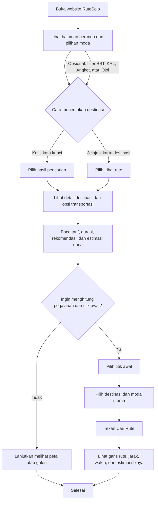

# Workflow Pengunjung RuteSolo

Dokumen ini menjelaskan alur pengunjung saat menggunakan website RuteSolo untuk menemukan destinasi wisata Solo dan merencanakan perjalanan.

## Ringkasan Alur

## Langkah Penggunaan

### 1. Buka dan jelajahi beranda

Pengunjung membuka RuteSolo dan melihat pengantar destinasi wisata Surakarta serta pilihan filter moda. Gunakan navigasi halaman untuk menuju daftar destinasi, Route Planner, peta, galeri, atau informasi tentang RuteSolo.

### 2. Temukan destinasi

Destinasi dapat ditemukan dengan dua cara:

- **Pencarian:** tekan tombol pencarian di navbar, lalu ketik nama, kategori, deskripsi, atau tag seperti “Keraton”, “Museum”, atau “Kuliner”. Pilih salah satu saran untuk membuka detailnya.
- **Jelajahi kartu:** scroll ke bagian **Wisata paling populer**, lalu pilih **Lihat rute** pada kartu destinasi.

Sebelum memilih, pengunjung dapat menyaring kartu berdasarkan moda **BST**, **KRL**, **Angkot**, atau **Ojol**. Daftar akan menampilkan destinasi yang memiliki pilihan moda tersebut.

### 3. Baca detail rute dan estimasi dana

Panel detail menampilkan deskripsi destinasi dan pilihan rute yang tersedia, termasuk moda, petunjuk perjalanan, tarif, dan perkiraan durasi. Pilihan yang direkomendasikan ditampilkan lebih dahulu. Ojol ditandai sebagai opsi last-mile; aplikasi menyarankan untuk mengutamakan transportasi umum.

Pada bagian **Estimasi Dana**, pengunjung dapat memilih titik keberangkatan yang tersedia untuk melihat perkiraan biaya transportasi, tiket masuk, dan total dana. Periksa kembali jadwal serta tarif terbaru sebelum berangkat karena informasinya dapat berubah.

### 4. Rencanakan perjalanan

Di bagian **Rencanakan perjalananmu**:

1. Tentukan titik awal dengan salah satu cara berikut:
   - **Lokasi saya:** izinkan akses lokasi pada browser. Jika lokasi tidak tersedia atau izin ditolak, gunakan pilihan lain.
   - **Pilih di peta:** tekan tombol tersebut, lalu klik lokasi awal pada peta.
   - **Koordinat manual:** isi latitude dan longitude.
2. Pilih destinasi wisata.
3. Pilih moda utama: transportasi umum, BST, KRL, Angkot, atau Ojol last-mile.
4. Tekan **Cari Rute**.
5. Jika rute berhasil dihitung, peta menampilkan garis perjalanan dan hasil menampilkan jarak, perkiraan waktu, perkiraan ongkos per moda yang tersedia, tiket masuk, serta total estimasi.

Jika input belum lengkap, lokasi tidak tersedia, atau perhitungan gagal, ikuti pesan status pada planner. Pengunjung juga dapat kembali melihat panduan moda pada detail destinasi.

> **Catatan:** garis rute pada planner dihitung sebagai rute jalan oleh layanan OSRM. Pilihan moda digunakan untuk menyajikan estimasi biaya, bukan sebagai jadwal atau petunjuk transit langsung per halte. Gunakan detail rute transportasi umum sebagai panduan dan verifikasi informasi operasional sebelum perjalanan.

### 5. Gunakan peta dan galeri

- **Peta destinasi & jalur BST:** lihat marker destinasi dan tekan marker untuk melihat nama serta kategori tempat. Lima koridor BST ditampilkan dengan warna berbeda; tekan tombol **Sembunyikan jalur BST** atau **Tampilkan jalur BST** untuk mengatur overlay semua koridor.
- **Wajah kota Solo:** jelajahi foto menggunakan filmstrip thumbnail; galeri juga mendukung navigasi sentuh.
- **Tema tampilan:** tombol tema di navbar mengganti dark/light mode dan menyimpan pilihan pada browser.

## Hasil Akhir

Setelah mengikuti workflow, pengunjung memperoleh gambaran destinasi yang dituju, pilihan moda beserta tarif dan durasi indikatif, serta perkiraan jarak, waktu, dan biaya perjalanan dari titik awal yang dipilih.

## Referensi Implementasi

- [Halaman utama dan elemen UI](./index.php)
- [Interaksi pencarian, detail destinasi, peta, galeri, dan planner](./script.js)
- [Dokumentasi fitur RuteSolo](./README.md)
